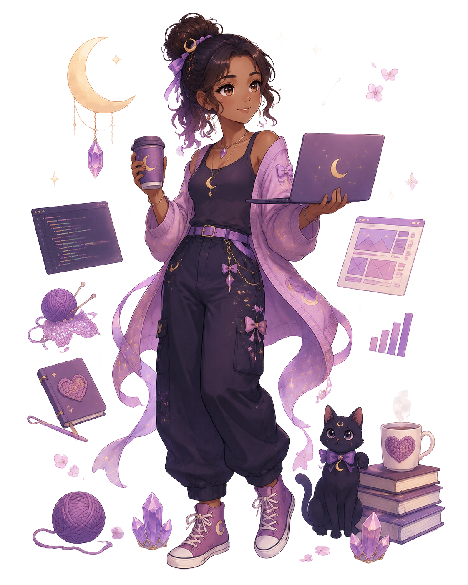
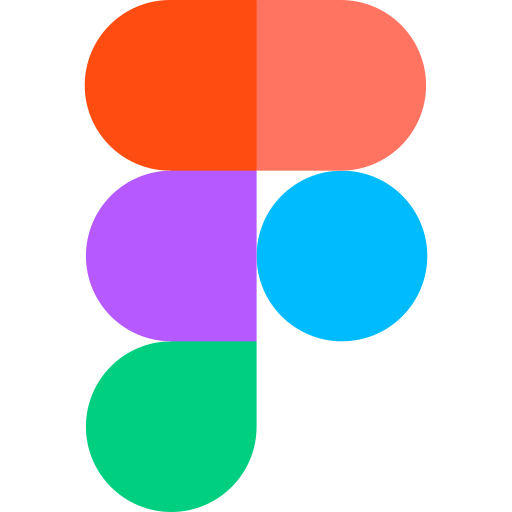
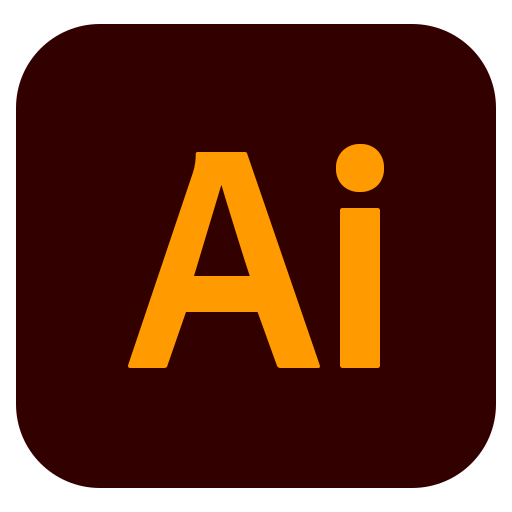
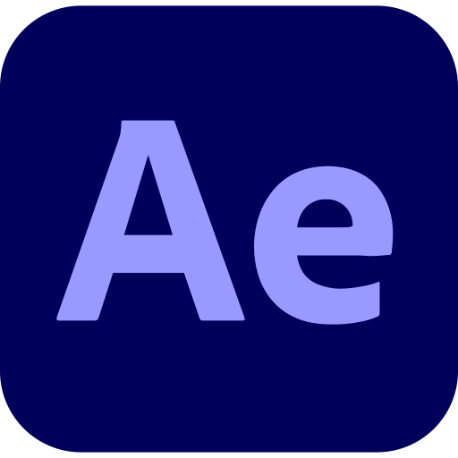
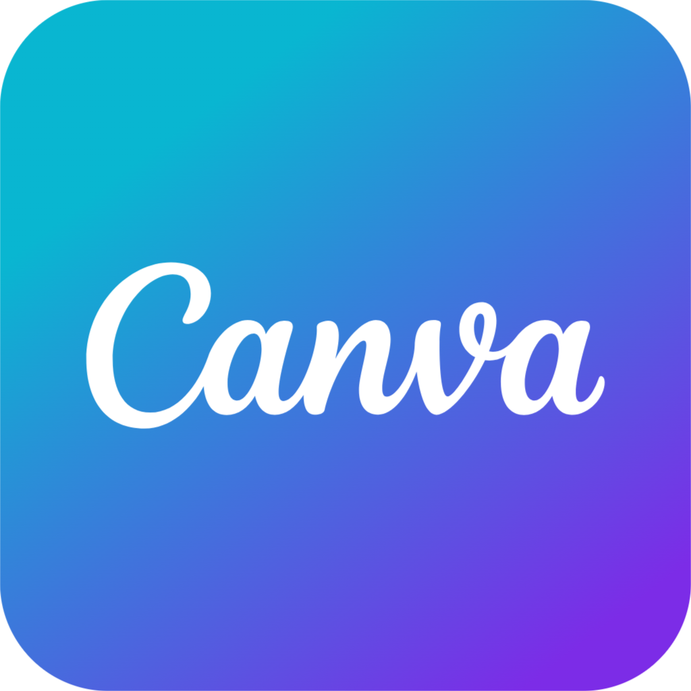

  # Bem-vindo(a) ao meu Github!
  

 

<!-- -->

## 🌙 Sobre

Olá! Eu sou a **Jheane** 💜

Sou uma desenvolvedora Front-end em transição de carreira, apaixonada por tecnologia, design e experiências digitais.

Minha trajetória começou na área de **dados**, trabalhando com bancos de dados, relatórios e resolução de problemas. Hoje utilizo essa base analítica para desenvolver interfaces modernas, acessíveis e intuitivas.

Meu objetivo é criar aplicações que unam **beleza, organização e funcionalidade**.

> ✨ *"Cada linha de código é um pequeno passo para construir algo mágico."*

---

# 🌸 Foco atual

🌙 Aprofundando JavaScript  
⚛️ Aprendendo React e componentização  
💜 Estudando UX/UI e acessibilidade  
⭐ Desenvolvendo projetos autorais para o portfólio

---

# 🌙 Projetos

## 🥁 Bateria

🌙 Simulador de bateria pelo teclado.
**Pratiquei:** entrada de valores no teclado, manipulação do DOM, responsividade, uso de sons no JS, uso de template string.

<a href="https://jheane.github.io/B7Web/Web/Desafio%207%20projetos%20em%207%20dias/Projeto%201%20-%20Bateria/">🔗 **Demo**</a> | <a href="https://github.com/Jheane/B7Web/tree/main/Web/Desafio%207%20projetos%20em%207%20dias/Projeto%201%20-%20Bateria">💻 **Código**</a>

## ⏰ Relógio

🌸 Projeto para visualização de horas, minutos e segundos com relógios analógico e digital.
**Pratiquei:** manipulação do DOM, manipulação de data, transformação/rotação de elementos

<a href="https://jheane.github.io/B7Web/Web/Desafio%207%20projetos%20em%207%20dias/Projeto%202%20-%20Relógio/">🔗 **Demo**</a> | <a href="https://github.com/Jheane/B7Web/tree/main/Web/Desafio%207%20projetos%20em%207%20dias/Projeto%202%20-%20Rel%C3%B3gio">💻 **Código**</a>

## ⛅ Clima

✨ Aplicação para consultar o clima atual de uma cidade por meio da OpenWeather API.
**Pratiquei:** consumo de API, Fetch, async/await, manipulação do DOM e tratamento de respostas.

<a href="https://jheane.github.io/B7Web/Web/Desafio%207%20projetos%20em%207%20dias/Projeto%203%20-%20Clima/">🔗 **Demo**</a> | <a href="https://github.com/Jheane/B7Web/tree/main/Web/Desafio%207%20projetos%20em%207%20dias/Projeto%203%20-%20Clima">💻 **Código**</a>

---

# 💎 Tech Stack

### 🌸 Front-end

 

### 🌙 Ferramentas

### 🎨 Design

---

# 🌟 GitHub Analytics

---

# ✨ Let's Connect

---

✦ ☾ ☆ 🌸 Code with Logic Create with Heart 🌸 ☆ ☽ ✦

